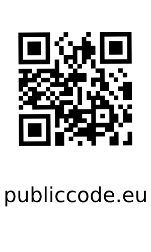

# Public Money Public Code

What it is all about and why it just makes sense.

---

# The world we are living in

- is getting more digital every day
- software is everywhere
- governments and public institutions use mostly proprietary software or manual processes
- effort is duplicated all over the world
- we pay all of those with our taxes

---

# Why is that an issue?

- its not always transparent what money is spent on (e.g. licenses)
- much of the used software used is neither secure nor reliable
- every institution has to solve the same problems over and over again
- security by obscurity is not a good idea

---

# Real world examples

---

# PC-Wahl

---

# PC-Wahl - German election software

- used in many german states
- proprietary software
- security issues until this day
- no transparency

---

# PC-Wahl - German election software

## Timeline

- 2017
    - CCC finds security issues that allow tampering with election results
    - updates are provided, but dont fix the issues
    - CCC provides a open source version of the software which is secure, but will never be used
- 2024
    - is used for election in Saxony
    - calculates wrong results
    - only corrected due to manual recount by independent experts

---

# PC-Wahl - German election software

- still used in many states
- no transparency about the software and its security
- patches have been provided - payed, with our taxes
- still not secure

---

# Corona Warn App

---

# Real world examples | Corona Warn App

- started in April 2020, during the pandemic
- development led by SAP and Deutsche Telekom
- widely used in Germany (over 45 million downloads)
- open source from the beginning
- privacy by default
- 50 days until the first release

---

# Real world examples | Corona Warn App

## Timeline

- April 2020
    - planning starts
- May 2020
    - development starts, fully on GitHub
- June 2020
    - first release

---

# Real world examples | Corona Warn App

## Timeline

- 2021
    - features are added, bugs are fixed - lot of community contributions
    - used as blueprint for other countries
- 2023
    - still in use, still maintained
    - possibly used for other purposes in the future

---

# Comparison

| PC-Wahl               | Corona Warn App                                     |
|:----------------------|:----------------------------------------------------|
| proprietary           | open source                                         |
| security issues       | privacy by default, secure and audited by thousands |
| no transparency       | full transparency                                   |
| slow updates          | fast updates                                        |
| unknown price         | ~ 214 million € (development and maintenance)       |
| exclusive for germany | used as blueprint for other countries               |

---

# Conclusion

- public code works
- open source is more secure, not less
- cost and effort is reduced
- fosters collaboration and engagement with the people

---

# We are not alone

Public Money - Public Code is a initiative by the Free Software Foundation

> We want legislation requiring that publicly financed software developed for the public sector be made publicly
> available under a Free and Open Source Software licence. If it is public money, it should be public code as well.

---

# What can you do?

- check programs for political parties
- ask your local government about the software they use
- ask for transparency
- support the initiative
- spread the word

---

# The End

Digitalization, also for public institutions is a chance, not a threat. Let us use it wisely and most importantly,
let us do it together and transparent.
